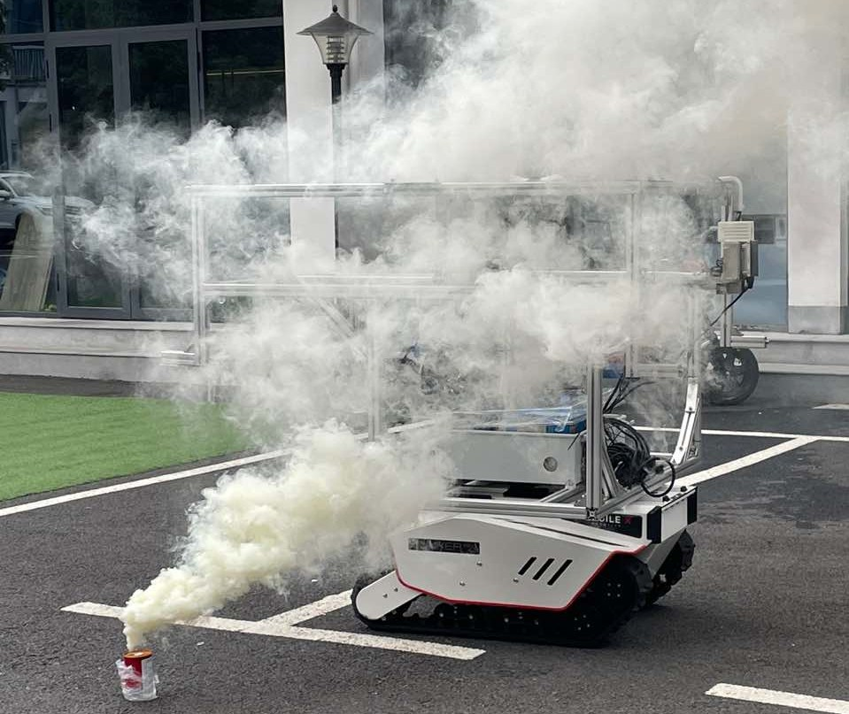

# Manual Camera-LiDAR-Radar Calibration

## 外参标定

https://github.com/MMOCKING/manual_calib

### 备注

- 本仓库基于 https://github.com/icameling/lidar_camera_calibration/tree/manual_calib 开发。
- 需要修改config目录下的相机内参。
- 如果需要微调，可以修改cfg/Locator.cfg文件中的外参初值与上下限。
- 相机-激光雷达外参标定的空格键图像暂停功能有BUG，可以避免使用。
- 相关传感器的先验旋转参考**标定示例**。

### 相机-激光雷达外参标定

在launch文件中修改订阅的topic与点云显示距离。注意，需要根据图片topic是否为compressed类型修改lidar_cam_calib.cpp下的变量类型，即`sensor_msgs::CompressedImage`相关内容。

另外，为了去除红外相机的黑边，lidar_cam_calib.cpp对接收到的图像进行了裁剪，在不使用红外相机时需要注释相关代码：`image_now = image_now(cv::Rect(640, 300, 640, 480));`。

```shell
roslaunch ilcc2 lidar_cam_calib.launch
```

使用rqt窗口内的roll/pitch/yaw/x/y/z移动激光点云，调整外参。本仓库中采用的旋转顺序为YXZ。

### 毫米波雷达-激光雷达外参标定

```shell
roslaunch ilcc2 lidar_radar_calib.launch
```

使用rqt窗口内的roll/pitch/yaw/x/y/z移动激光点云，调整外参。本仓库中采用的旋转顺序为YXZ。

## ROSBAG数据提取

在launch与cpp文件中分别修改读取的bag地址与topic。

```
roslaunch ilcc2 bag_extractor.launch
```

## 传感器安装示例

由上至下：固态激光雷达--RGBD相机--红外成像仪--4D毫米波雷达


## 夜间烟雾序列示意

图中分别为：灰度红外热成像、RGB可见光图像、彩色激光点云、白色毫米波点云

注：红外成像为1920\*1080的图片，带有黑框，实际图像为640\*480。

烟雾对激光和可见光有明显的遮挡，毫米波不受影响、红外光受影响较小。


## 日间烟雾序列示意

数据采集场景：



红外成像仪在烟雾中受影响很小。

https://github.com/MMOCKING/manual_calib/assets/61079012/a9ad471f-6c48-4780-8d07-7aca2389e94b

## 日间晴朗序列示意

红外成像仪能提供较清晰的图像。

https://github.com/MMOCKING/manual_calib/assets/61079012/cfaede69-b8fa-4d71-8293-d795d60319e0

## 标定示例

### 红外内参标定

大立VD641相机输出有黑边，需要去除。用太阳光均匀照大标定板，使用rosbag录下数据后，提取图片至本地，使用matlab标定工具箱标定。

分别用matlab标定了有黑边1920\*1080和去除黑边640\*480图像。


```matlab
cameraParams.ImageSize
1080    1920

cameraParams.IntrinsicMatrix
1110.82549521097	0	0
0	1109.54028549222	0
912.993567282656	452.657733048226	1

cameraParams.TangentialDistortion
0	0

cameraParams.RadialDistortion
-0.230149580219241	0.150581510284111
```

```matlab
cameraParams.ImageSize
480    640

cameraParams.IntrinsicMatrix
1104.50195815164	0	0
0	1104.80247345753	0
281.815052848494	166.229103132276	1

cameraParams.TangentialDistortion
0	0

cameraParams.RadialDistortion
-0.200600349900097   -0.045799082965466
```

### 激光-红外标定

点云转化关系：$P_c = R * P_l + t$；
然后将$P_c$通过内参投影至像素平面。

原代码有万向节死锁问题，修改旋转顺序ZYX为YXZ。更换库函数setRPY()为setRPY_YXZ()函数。同理也可替换为XYZ等顺序。

根据订阅的图像是否为compressed需要修改代码中的变量类型。

```
[ INFO] [1700451415.130203404]: Reconfigure Request (rpyxyz): 84.40 84.20 -2.00 -0.02 -0.18 -0.11
^C[rqt_reconfigure-2] killing on exit
[lidar_cam_calib-1] killing on exit
==========================

R lidar_to_cam:
  0.0664396   -0.996152 -0.00519986
  0.0987163   0.0133326   -0.993304
   0.991262   0.0638682    0.100995
P lidar_to_cam:
-0.02 -0.18 -0.11
```


### 激光-毫米波标定

根据原lidar_cam_calib的手动激光-毫米波标定。

点云转换关系：$P_r = R * P_l + t$

| roll | pitch | yaw  | x    | y     | z    |
| ---- | ----- | ---- | ---- | ----- | ---- |
| 0.00 | 0.50  | 4.80 | 3.85 | -0.02 | 0.3  |

```cpp
R lidar_to_radar:
   0.996455  -0.0836778  0.00869593
  0.0836747    0.996493 0.000730218
-0.00872654           0    0.999962
P lidar_to_radar:
 3.85 -0.02   0.3

```


