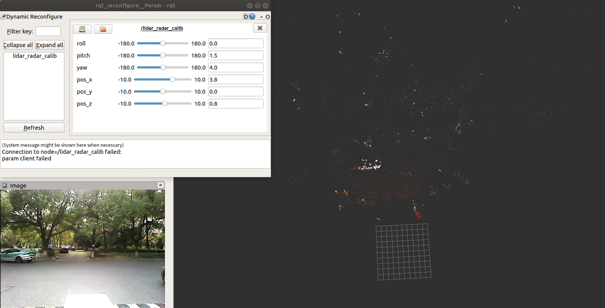
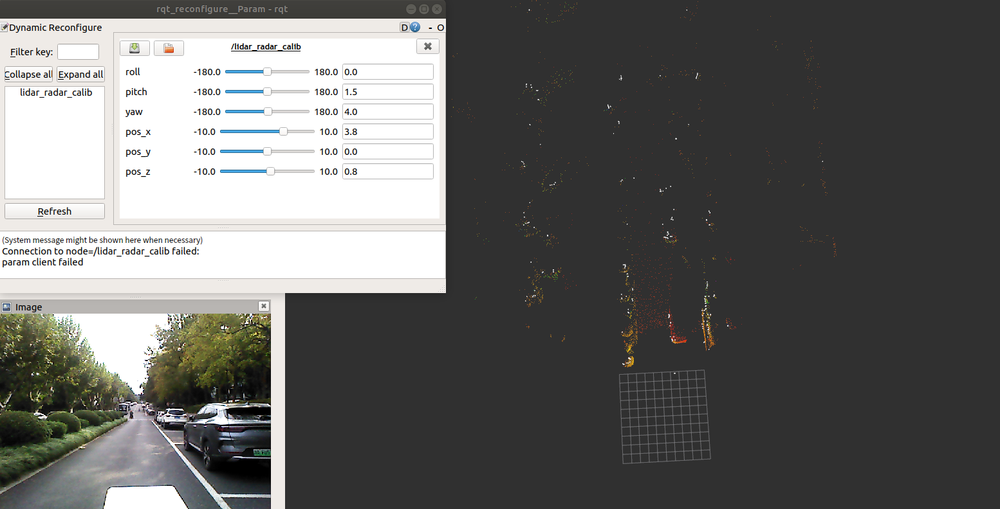

# Manual Camera-LiDAR-Radar Calibration

相机-激光雷达外参标定

```shell
roslaunch ilcc2 lidar_cam_calib.launch
```

毫米波雷达-激光雷达外参标定

```shell
roslaunch ilcc2 lidar_radar_calib.launch
```

使用rqt窗口内的roll/pitch/yaw/x/y/z调整外参。

## 传感器安装示例

由上至下：固态激光雷达--RGBD相机--红外成像仪--4D毫米波雷达


## 夜间烟雾序列示意

图中分别为：灰度红外热成像、RGB可见光图像、彩色激光点云、白色毫米波点云

注：红外成像为1920\*1080的图片，带有黑框，实际图像为640\*480。

烟雾对激光和可见光有明显的遮挡，毫米波不受影响、红外光受影响较小。


## 日间序列示意

红外成像仪能提供较清晰的图像。

https://github.com/MMOCKING/manual_calib/assets/61079012/cfaede69-b8fa-4d71-8293-d795d60319e0

## 红外内参标定

分别用matlab标定了有黑边1920\*1080和去除黑边640\*480图像。

需要用太阳光均匀照大标定板。


```matlab
cameraParams.ImageSize
1080    1920

cameraParams.IntrinsicMatrix
1110.82549521097	0	0
0	1109.54028549222	0
912.993567282656	452.657733048226	1

cameraParams.TangentialDistortion
0	0

cameraParams.RadialDistortion
-0.230149580219241	0.150581510284111
```

```matlab
cameraParams.ImageSize
480    640

cameraParams.IntrinsicMatrix
1104.50195815164	0	0
0	1104.80247345753	0
281.815052848494	166.229103132276	1

cameraParams.TangentialDistortion
0	0

cameraParams.RadialDistortion
-0.200600349900097   -0.045799082965466
```

## 激光-红外标定

点云转化关系：
$$
P_c = R * P_l + t
$$
然后将$P_c$通过内参投影至像素平面。

https://github.com/icameling/lidar_camera_calibration/tree/manual_calib

原代码有万向节死锁问题，修改旋转顺序ZYX为YXZ。更换库函数setRPY()为setRPY_YXZ()函数。同理也可替换为XYZ等顺序。

根据订阅的图像是否为compressed需要修改代码中的变量类型。

| roll  | pitch | yaw   | x    | y     | z     |
| ----- | ----- | ----- | ---- | ----- | ----- |
| 84.70 | 84.00 | -2.20 | 0.00 | -0.18 | -0.18 |

```cpp
R lidar_to_cam:
  0.0664371   -0.992042 -0.00982091
  0.0976066   0.0218043   -0.988996
   0.987278   0.0590989    0.104451
P lidar_to_cam:
    0 -0.18 -0.18
```


## 激光-毫米波标定

根据原lidar_cam_calib的手动激光-毫米波标定。

点云转换关系：
$$
P_r=R*P_l+t
$$

| roll | pitch | yaw  | x    | y    | z    |
| ---- | ----- | ---- | ---- | ---- | ---- |
| 0.00 | 1.50  | 4.00 | 3.80 | 0.00 | 0.80 |

```cpp
R lidar_to_radar:
  0.997222 -0.0697565  0.0261132
 0.0697326   0.997564 0.00182601
-0.0261769          0   0.999657
P lidar_to_radar:
3.8   0 0.8
```






